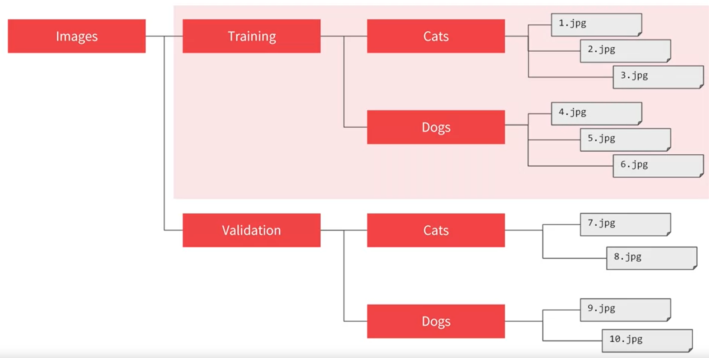
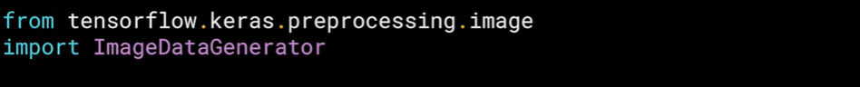
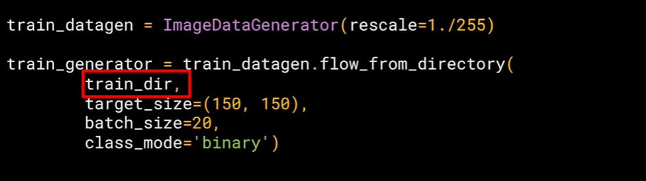

# Convolutional Neural Networks Tensorflow

In Course 2 of the deeplearning.ai TensorFlow Specialization, you will learn advanced techniques to improve the computer vision model you built in Course 1. You will explore how to work with real-world images in different shapes and sizes, visualize the journey of an image through convolutions to understand how a computer “sees” information, plot loss and accuracy, and explore strategies to prevent overfitting, including augmentation and dropout. Finally, Course 2 will introduce you to transfer learning and how learned features can be extracted from models. 

## Where to find the notebooks for this course

All notebooks in this course can be run in either Google Colab or Coursera Labs. **You don’t need a local environment set up to follow the coding exercises**. You can simply click the <code>Open in Colab</code> badge at the top of the ungraded labs while for the assignments, you will be taken automatically to Coursera Labs.

However, if you want to run them on your local machine, the ungraded labs and assignments for each week can be found in this [Github repository](https://github.com/https-deeplearning-ai/tensorflow-1-public) under the C2 folder. If you already have git installed on your computer, you can clone it with this command:

<pre></pre>
<code>git clone https://github.com/https-deeplearning-ai/tensorflow-1-public</code>
</pre>

## You will need these packages if you will run the notebooks locally

<pre>
<code>
    tensorflow==2.7.0
    scikit-learn==1.0.1
    pandas==1.1.5
    matplotlib==3.2.2
    seaborn==0.11.2
</code>
</pre>

## The cats vs dogs dataset

[Kaggle Dogs v Cats dataset](https://www.kaggle.com/c/dogs-vs-cats)

## Dataset Tree

## How To Organise Our Dataset

## Create The Model

