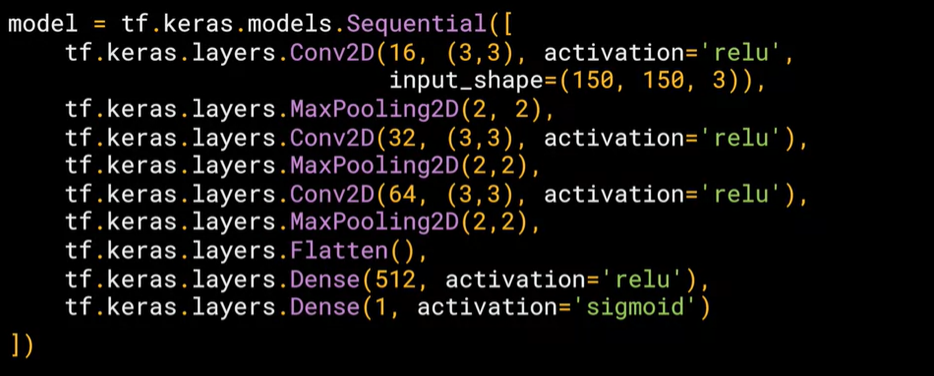
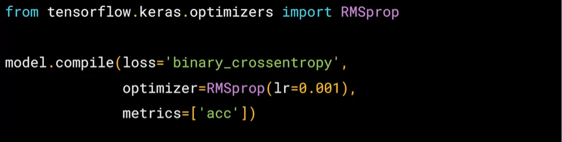
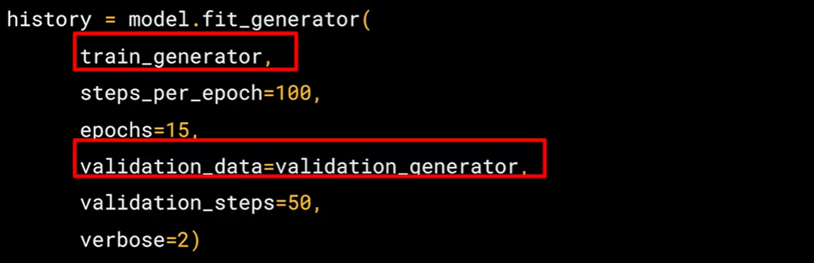
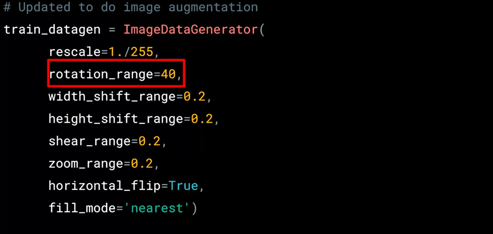
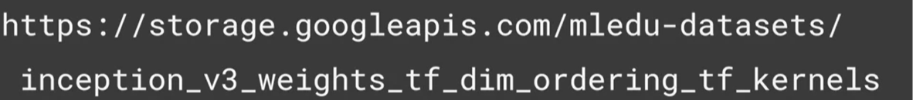
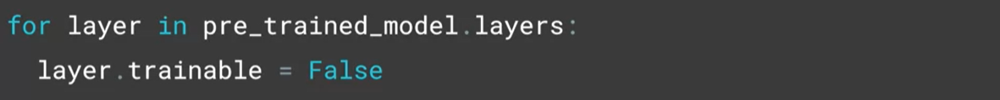
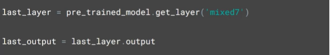
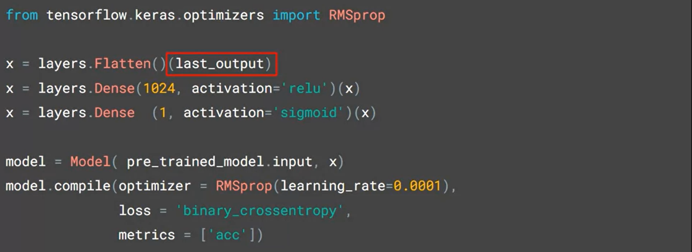

# Convolutional Neural Networks Tensorflow

In Course 2 of the deeplearning.ai TensorFlow Specialization, you will learn advanced techniques to improve the computer vision model you built in Course 1. You will explore how to work with real-world images in different shapes and sizes, visualize the journey of an image through convolutions to understand how a computer “sees” information, plot loss and accuracy, and explore strategies to prevent overfitting, including augmentation and dropout. Finally, Course 2 will introduce you to transfer learning and how learned features can be extracted from models. 

## Where to find the notebooks for this course

All notebooks in this course can be run in either Google Colab or Coursera Labs. **You don’t need a local environment set up to follow the coding exercises**. You can simply click the <code>Open in Colab</code> badge at the top of the ungraded labs while for the assignments, you will be taken automatically to Coursera Labs.

However, if you want to run them on your local machine, the ungraded labs and assignments for each week can be found in this [Github repository](https://github.com/https-deeplearning-ai/tensorflow-1-public) under the C2 folder. If you already have git installed on your computer, you can clone it with this command:

<pre></pre>
<code>git clone https://github.com/https-deeplearning-ai/tensorflow-1-public</code>
</pre>

## You will need these packages if you will run the notebooks locally

<pre>
<code>
    tensorflow==2.7.0
    scikit-learn==1.0.1
    pandas==1.1.5
    matplotlib==3.2.2
    seaborn==0.11.2
</code>
</pre>

## The cats vs dogs dataset

[Kaggle Dogs v Cats dataset](https://www.kaggle.com/c/dogs-vs-cats)

## Dataset Tree

## How To Organise Our Dataset

## Create The Model

## Compilation

## Generator

## Image Generator

## WEEK 3

Building models for yourself is great, and can be very powerful. But, as you've seen, you can be limited by the data you have on hand. Not everybody has access to massive datasets or the compute power that's needed to train them effectively. Transfer learning can help solve this -- where people with models trained on large datasets train them, so that you can either use them directly, or, you can use the features that they have learned and apply them to your scenario. This is Transfer learning, and you'll look into that this week!

## Learning Objectives

* Master the keras layer type known as dropout to avoid overfitting
* Achieve transfer learning in code using the keras API
* Code a model that implements Keras’ functional API instead of the commonly used Sequential model
* Learn how to freeze layers from an existing model to successfully implement transfer learning
* Explore the concept of transfer learning to use the convolutions learned by a different model from a larger dataset

## Coding transfer learning from the inception model

## Link To Copy Pretrained Model

* [https://storage.googleapis.com/nledu-datasets/inception_v3_weights_tf_dim_ordering_tf_kernels](https://storage.googleapis.com/nledu-datasets/inception_v3_weights_tf_dim_ordering_tf_kernels)

## Do Not Training The Model

## Summary The Model

## Coding your own model with transferred features

## Resources

* [https://discourse.deeplearning.ai/](https://discourse.deeplearning.ai/)
* [https://docs.google.com/document/d/1xrWj9plgme08hcxj5L5tEhOuQCa4W8_eN3E1kSb2pW0/edit#heading=h.9wfgljijo9b9](https://docs.google.com/document/d/1xrWj9plgme08hcxj5L5tEhOuQCa4W8_eN3E1kSb2pW0/edit#heading=h.9wfgljijo9b9)
* [https://community.deeplearning.ai/c/tf1/tf1-course-2/80](https://community.deeplearning.ai/c/tf1/tf1-course-2/80)
* [https://keras.io/api/preprocessing/image/](https://keras.io/api/preprocessing/image/)

